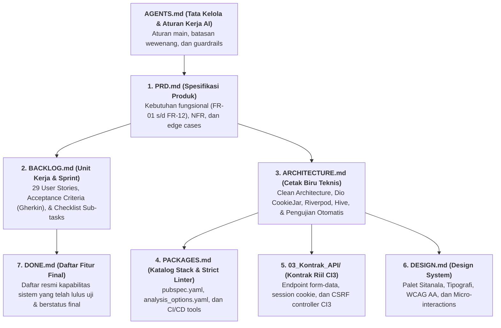

# 🤖 ATURAN KERJA & PROTOKOL AI AGENT
## SIIJAPIN Mobile — RSUP Dr. Sitanala Tangerang

Dokumen ini adalah **Protokol Tata Kelola AI (*Agent Governance & Guardrails*)** resmi yang mengikat seluruh AI coding assistant (Google Antigravity, Cursor, Claude Code, ChatGPT, GitHub Copilot) yang bekerja pada repositori dan *workspace* pengembangan **SIIJAPIN Mobile**.

---

## 1. Profil Pengembang & Organisasi Pemilik Sistem

* **Unit Kerja Pengelola**: Instalasi Sistem Informasi Rumah Sakit (ISIRS)
* **Basis Data Pengetahuan (*Knowledge Base*)**: `D:\project\obsidian\sijapin\`
* **Sistem Web Eksisting**: `https://rsup-drsitanala.net/siijapin-v2/`

---

## 2. Peta Dokumen Sumber Kebenaran Tunggal (SSOT Map)

Setiap AI Agent yang beroperasi **WAJIB** membaca dan mematuhi hierarki dokumen berikut:



---

## 3. Prinsip Kerja & Disiplin Eksekusi

1. **Rencana Dulu, Baru Eksekusi**:
   * Sebelum menulis baris kode untuk tugas apa pun, ajukan garis besar rencana implementasi.
   * Granularitas langkah bersifat **adaptif terhadap ukuran berkas `.md` fitur**:
     * Fitur dengan cakupan spesifikasi ringkas/sederhana dapat dikerjakan dalam satu kesatuan logis.
     * Fitur besar/kompleks dipecah menjadi tahapan-tahapan kecil yang terukur.
   * **Wajib STOP setelah langkah/fitur selesai**: Laporkan file yang diubah dan ringkasan status uji. Dilarang otomatis mengeksekusi langkah berikutnya tanpa konfirmasi/instruksi eksplisit dari pengguna.
2. **Kepatuhan Dokumen Acuan**:
   * Dilarang mengasumsikan requirement yang tidak tertulis di berkas `docs/` atau spesifikasi fitur. Jika menemukan ambiguitas, wajib bertanya dan mengonfirmasi ke pengguna.

---

## 4. Batasan Mutlak AI Agent (Non-Negotiable Guardrails)

> [!CAUTION] PERINGATAN MUTLAK BAGI AI AGENT
> Pelanggaran terhadap 6 aturan emas di bawah ini akan membatalkan seluruh kode yang dihasilkan.

### 🔴 Aturan 1: Zero-Backend-Change Policy
* **DILARANG KERAS** mengasumsikan, merancang, atau meminta perubahan kode pada server PHP CodeIgniter 3 RSUP Dr. Sitanala.
* Backend CI3 saat ini **tidak diubah**. Klien Flutter wajib bertindak sebagai *client adapter* yang mengelola cookie sesi `ci_session` (`PersistCookieJar`) dan token CSRF (`ci_csrf_token`) secara otomatis.
* Jangan pernah berhalusinasi membuat endpoint baru seperti `/api/v1/*` atau mengubah hashing password (server menggunakan `md5($kunci)` pada tabel `m_customer`).

### 🔴 Aturan 2: Wajib Konfirmasi Sebelum Eksekusi Tindakan
* **DILARANG** menjalankan perintah eksekusi terminal, membuat folder baru, atau menulis baris kode implementasi tanpa izin dan konfirmasi eksplisit dari pengguna.
* Selalu diskusikan rencana, sajikan outline, dan minta persetujuan sebelum mengeksekusi perubahan berkas.

### 🔴 Aturan 3: Zero-Hallucination & Spec-Driven Development
* Seluruh variabel, nama kolom database, format data, dan alur form wajib mengacu pada:
  - Skema tabel SQL asli di [[02_Audit_Web_Eksisting/06_Skema_Database_SIMRS_Sitanala]].
  - Kontrak endpoint di [[03_Kontrak_API/01_Arsitektur_API_Gateway_&_Auth]] dan [[03_Kontrak_API/02_Endpoint_Booking_&_Kamar]].
* Dilarang menciptakan field fiktif (contoh: form registrasi akun **tidak memiliki field NIK**; tabel `m_pegawai` **tidak memiliki kolom foto dokter**).

### 🔴 Aturan 4: Kepatuhan Privasi Data Medis (UU PDP No. 27/2022)
* Seluruh data identitas kependudukan dan medis wajib disensor di layar antarmuka (*Data Masking*):
  - NIK 16 digit: `367104******0002` (hanya tampil 6 digit awal & 4 digit akhir).
  - No. Kartu BPJS: `000123****789`.
  - No. HP: `0812****8901`.
* Kredensial lokal wajib disimpan pada hardware keystore/keychain (`FlutterSecureStorage`).
* Dilarang keras menaruh *secret key* atau mencetak password/NIK di log konsol rilis.

### 🔴 Aturan 5: Kompatibilitas Fisik Mesin Kiosk APM Rumah Sakit
* Kode booking wajib berupa **13 digit numerik murni** (`YYYYMMDD` + counter 5 digit).
* QR Code pada layar ponsel **murni mengenkode string numerik `KODE_BOOKING`** (tanpa prefix pipa teks buatan).
* Ponsel bertindak murni sebagai kartu identitas digital (*display*); **tidak ada check-in GPS geofencing dan tidak ada pemindaian kamera dari HP pasien**. Check-in dilakukan dengan menempelkan layar HP ke scanner optik 2D mesin APM fisik di lobi RS.

### 🔴 Aturan 6: Jadwal & Kuota Poliklinik
* Poliklinik hanya melayani pada hari kerja: **Senin s/d Jumat** (Sabtu, Minggu, dan Hari Libur Nasional dinonaktifkan di kalender).
* Kuota antrean dikendalikan per **Unit Poliklinik** (`KUOTA_JKN` dan `KUOTA_NONJKN`), bukan per dokter individu.
* Rawat Jalan Umum **tidak menggunakan Virtual Account** (bayar langsung di kasir RS pada hari-H).

---

## 5. Kebijakan Testing & Verifikasi Otomatis (*Zero-Manual-Check*)

Untuk memastikan kode yang dihasilkan AI layak produksi (*Grade S*) tanpa membebani pengguna dengan *code review* manual:

1. **Kewajiban Pengujian Mandiri oleh AI**:
   * AI **dilarang** mengklaim sebuah fitur selesai hanya berdasarkan teks.
   * Setiap kali selesai menulis/memodifikasi kode, AI **wajib menjalankan pengujian otomatis** (`flutter analyze` dan `flutter test`).
2. **Format Pelaporan Ringkas (Anti-Spam Log)**:
   * Laporan hasil pengujian **tidak boleh memuat raw log terminal yang panjang**.
   * Cukup sertakan ringkasan status kelulusan pengujian, contoh:
     * `flutter analyze`: **0 issues (clean)**.
     * `flutter test`: **All tests passed (8/8 tests passed)**.
3. **Batas Percobaan Perbaikan (*Retry Budget*)**:
   * Jika ada uji yang gagal, AI hanya diperbolehkan mencoba memperbaiki sendiri maksimal **3x percobaan**.
   * Jika masih gagal setelah 3x percobaan: **Wajib STOP**. Laporkan secara ringkas: berkas/skenario yang gagal, pesan error, dan dugaan penyebabnya ke pengguna.
1. **Konvensi Struktur Folder Pengujian (*Feature-First Mirroring*)**:
   * Kode aplikasi ditempatkan di `lib/features/<nama_fitur>/...`.
   * Berkas pengujian unit & widget **wajib ditempatkan di folder `test/` di root** (dilarang menaruh berkas test di dalam `lib/` karena melanggar linter package manager Dart).
   * Struktur folder di dalam `test/` wajib **mencerminkan (*mirroring*)** struktur di dalam `lib/` 1:1, dengan akhiran nama berkas **`_test.dart`** (contoh: `test/features/auth/domain/login_usecase_test.dart`).
   * Pengujian alur penuh E2E ditempatkan pada direktori terpisah: **`integration_test/`**.
   * Berkas data tiruan JSON disimpan terpusat di **`test/fixtures/`**.

---

## 6. Kebijakan Mock & Data Dummy

1. **Untuk Pengujian Otomatis (`test/`)**:
   * **Wajib menggunakan mock/dummy data** (menggunakan `mocktail` atau berkas JSON di `test/fixtures/`).
   * Dilarang keras menembak server live CI3 saat menjalankan automated test demi mencegah polusi data sampah pada database SIMRS live.
2. **Untuk Fase Development / Slicing UI (`lib/`)**:
   * Diperbolehkan menggunakan data dummy statis untuk mempercepat perancangan tata letak antarmuka.
   * **Syarat Mutlak**: Data dummy wajib diisolasi (misal di file data terpisah / `FakeRepository`), bukan ditulis mentah di dalam berkas widget tampilan.
   * Sebelum sebuah fitur dicatat sebagai **FINAL di `DONE.md`**, repository wajib sudah tersambung ke endpoint API riil atau database lokal Hive.

---

## 7. Protokol Code Intelligence (`GitNexus`)

AI wajib memanfaatkan kapabilitas server MCP **GitNexus** untuk mencegah regresi:

1. **Sebelum Mengubah Simbol Bersama (*Shared Code*)**:
   * Jika akan memodifikasi fungsi, class, service, atau model data yang digunakan lintas modul, jalankan:
     `impact({target: "symbolName", direction: "upstream"})`
   * Periksa *blast radius* (siapa saja pemanggilnya dan tingkat risikonya).
2. **Peringatan Risiko Tinggi**:
   * Jika hasil analisis dampak berstatus **HIGH** atau **CRITICAL**, AI wajib memperingatkan pengguna sebelum melakukan pengeditan.
3. **Verifikasi Perubahan**:
   * Gunakan `detect_changes()` untuk memverifikasi bahwa perubahan kode hanya menyentuh simbol dan alur eksekusi yang direncanakan.

---

## 8. Standar Penanganan Layar UI (Zero Red-Screen Policy)

Setiap layar yang dibangun oleh AI wajib menangani 3 *state* antarmuka secara tuntas tanpa perlu diingatkan:

1. **Loading State**: Efek shimmer otomatis (`skeletonizer`) saat data sedang diambil.
2. **Error / Empty State**: Tampilan pesan yang informatif dan ramah pasien disertai tombol aksi *"Coba Lagi"* jika koneksi gagal atau data kosong.
3. **Success State**: Menampilkan data riil secara rapi dan responsif.

---

## 9. Standar Definisi Selesai (DoD) & Pengelolaan `DONE.md`

Sebuah tugas/fitur dinyatakan **Selesai (*Done*)** dan berhak dicatat ke dalam berkas **`DONE.md`** hanya jika memenuhi kriteria berikut:

1. **Kesesuaian Spesifikasi**: Memenuhi seluruh *Acceptance Criteria* yang tertulis pada [[BACKLOG]] atau dokumen spesifikasi fitur terkait.
2. **Kepatuhan Arsitektur & Strict Linter**:
   * Mematuhi *Feature-First Clean Architecture* (Presentation $\rightarrow$ Domain $\rightarrow$ Data).
   * Lolos `flutter analyze` dengan **0 error dan 0 warning** sesuai aturan *Strict Mode* di `analysis_options.yaml`.
3. **Kelulusan Uji Otomatis**:
   * Seluruh unit/widget test terkait lulus uji (`flutter test`).
4. **Integrasi Nyata**:
   * Kode produksi sudah terhubung ke API riil / database lokal (tidak lagi menggunakan data dummy sementara).
5. **Pencatatan ke `DONE.md`**:
   * Dicatat secara ringkas ke dalam berkas **`DONE.md`** sebagai kapabilitas sistem yang sudah berstatus final dan teruji.

---

## 10. Panduan Membuka Chat Baru untuk AI

Saat Anda membuka percakapan baru di tools AI manapun, gunakan template prompt berikut agar agen langsung memuat seluruh aturan dan konteks kerja:

```text
Halo! Saya Ahmad Dhani Setiawan, S.Kom., Mobile Developer & Programmer SIMRS di RSUP Dr. Sitanala Tangerang.
Kita sedang mengerjakan proyek "SIIJAPIN Mobile" (Flutter).

Sebelum merespons, baca dan patuhi dokumen panduan tata kelola AI:
- D:\project\obsidian\sijapin\AGENTS.md

Dokumen acuan pengerjaan kita hari ini:
- Spesifikasi Produk: D:\project\obsidian\sijapin\PRD.md
- User Stories & Task: D:\project\obsidian\sijapin\BACKLOG.md
- Cetak Biru Teknis: D:\project\obsidian\sijapin\ARCHITECTURE.md
- Katalog Paket & Strict Linter: D:\project\obsidian\sijapin\PACKAGES.md
- Daftar Fitur Selesai: D:\project\obsidian\sijapin\DONE.md

Hari ini kita akan fokus pada fitur: [Sebutkan ID User Story atau Nama Fitur]
Mohon jelaskan rencana kerja dan outline sebelum mengeksekusi implementasi.
```

---
*Dokumen ini merupakan aturan tata kelola resmi pengembangan bersama AI Agent (Single Source of Truth).*

<!-- gitnexus:start -->
# GitNexus — Code Intelligence

This project is indexed by GitNexus as **sijapin_mobile** (255 symbols, 355 relationships, 4 execution flows). Use the GitNexus MCP tools to understand code, assess impact, and navigate safely.

> Index stale? Run `node .gitnexus/run.cjs analyze` from the project root — it auto-selects an available runner. No `.gitnexus/run.cjs` yet? `npx gitnexus analyze` (npm 11 crash → `npm i -g gitnexus`; #1939).

## Always Do

- **MUST run impact analysis before editing any symbol.** Before modifying a function, class, or method, run `impact({target: "symbolName", direction: "upstream"})` and report the blast radius (direct callers, affected processes, risk level) to the user.
- **MUST run `detect_changes()` before committing** to verify your changes only affect expected symbols and execution flows. For regression review, compare against the default branch: `detect_changes({scope: "compare", base_ref: "main"})`.
- **MUST warn the user** if impact analysis returns HIGH or CRITICAL risk before proceeding with edits.
- When exploring unfamiliar code, use `query({search_query: "concept"})` to find execution flows instead of grepping. It returns process-grouped results ranked by relevance.
- When you need full context on a specific symbol — callers, callees, which execution flows it participates in — use `context({name: "symbolName"})`.
- For security review, `explain({target: "fileOrSymbol"})` lists taint findings (source→sink flows; needs `analyze --pdg`).

## Never Do

- NEVER edit a function, class, or method without first running `impact` on it.
- NEVER ignore HIGH or CRITICAL risk warnings from impact analysis.
- NEVER rename symbols with find-and-replace — use `rename` which understands the call graph.
- NEVER commit changes without running `detect_changes()` to check affected scope.

## Resources

| Resource | Use for |
|----------|---------|
| `gitnexus://repo/sijapin_mobile/context` | Codebase overview, check index freshness |
| `gitnexus://repo/sijapin_mobile/clusters` | All functional areas |
| `gitnexus://repo/sijapin_mobile/processes` | All execution flows |
| `gitnexus://repo/sijapin_mobile/process/{name}` | Step-by-step execution trace |

## CLI

| Task | Read this skill file |
|------|---------------------|
| Understand architecture / "How does X work?" | `.claude/skills/gitnexus/gitnexus-exploring/SKILL.md` |
| Blast radius / "What breaks if I change X?" | `.claude/skills/gitnexus/gitnexus-impact-analysis/SKILL.md` |
| Trace bugs / "Why is X failing?" | `.claude/skills/gitnexus/gitnexus-debugging/SKILL.md` |
| Rename / extract / split / refactor | `.claude/skills/gitnexus/gitnexus-refactoring/SKILL.md` |
| Tools, resources, schema reference | `.claude/skills/gitnexus/gitnexus-guide/SKILL.md` |
| Index, status, clean, wiki CLI commands | `.claude/skills/gitnexus/gitnexus-cli/SKILL.md` |

<!-- gitnexus:end -->
