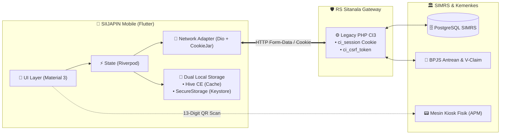
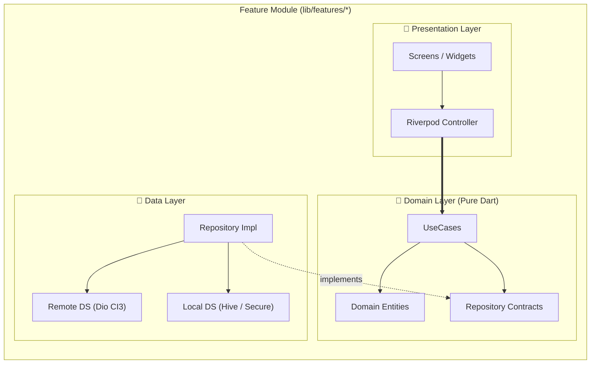
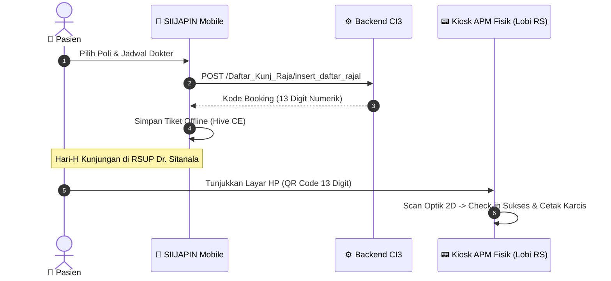
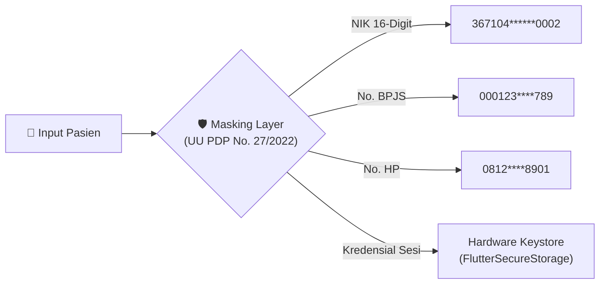

<div align="center">

# 📱 SIIJAPIN MOBILE
### Sistem Informasi dan Janji Temu Pasien Online
**RSUP Dr. Sitanala Tangerang — Kementerian Kesehatan RI**

[](https://flutter.dev)
[](https://dart.dev)
[](docs/ARCHITECTURE.md)
[](https://sentry.io)
[](.github/workflows/ci.yml)
[]()

*Klien mobile modern berstandar enterprise yang bertindak sebagai adapter stateful di atas backend SIMRS CodeIgniter 3.*

[🏛️ Arsitektur](#-arsitektur-sistem) • [✨ Fitur Utama](#-fitur-utama--status) • [🎨 Design System](#-design-system-palet-sitanala) • [🚀 Mulai Cepat](#-instalasi--pengembangan) • [🛡️ Kepatuhan](#️-keamanan--kepatuhan-data)

---
</div>

## 🌐 Arsitektur Sistem



## 🏗️ Feature-First Clean Architecture



## 🎯 Alur Pasien & Mesin APM Kiosk



## 🚀 Fitur Utama & Status

| Modul | Kemampuan Sistem | Offline Ready | Status |
| :--- | :--- | :---: | :---: |
| 🔐 **Autentikasi & Akun** | Registrasi, Login stateful `ci_session`, auto CSRF, Hardware Keystore | ❌ | 🟡 In Progress |
| 🏥 **Informasi Publik** | Cek Bed Rawat Inap Real-time, Jadwal Dokter Poliklinik | ⚠️ Cache | ⚪ Terencana |
| 🎫 **Booking Rajal** | Wizard pendaftaran Poli, Validasi Rujukan BPJS & Pasien Umum | ❌ | ⚪ Terencana |
| 📱 **Tiket Digital APM** | QR Code 13-Digit, Antrean Poliklinik, Navigasi Check-in Fisik | 🟢 **100%** | ⚪ Terencana |
| 🔔 **Notifikasi Lokal** | Pengingat H-1 Jadwal Poliklinik & Konfirmasi Antrean | 🟢 **100%** | ⚪ Terencana |
| 📊 **Monitoring & Audit** | Sentry Crash Reporting, Breadcrumb Navigasi, Auto Session | 🟢 **100%** | 🟢 **Aktif (Live)** |

## 🎨 Design System: Palet Sitanala

> *Panduan lengkap filosofi desain, tipografi, ergonomi, dan komponen UI dapat dilihat di [DESIGN.md](DESIGN.md).*

| Token | Warna | Hex Code | Peruntukan Utama |
| :--- | :---: | :--- | :--- |
| `brandDarkEspresso` | 🟫 | `#1C140E` | Teks utama, judul, header kontras tinggi |
| `brandGoldenCaramel` | 🟨 | `#AA7409` | Aksen primer, tombol CTA utama, ikon aktif |
| `brandWarmBronze` | 🟧 | `#825B0B` | Secondary branding, border fokus, kartu sorotan |
| `surfaceBg` | ⬜ | `#FAF8F5` | Background layar utama (warm clinical) |
| `clinicalTeal` | 🟩 | `#1B7369` | Status rawat inap, info medis & BPJS |
| `dangerCrimson` | 🟥 | `#AA2D11` | Error state, status batal & peringatan |

## 🛠️ Tech Stack & Standar Rekayasa

```text
├── Framework        : Flutter 3.47+ / Dart 3.13+ (Strict Mode)
├── State Management : Flutter Riverpod 2.6+ (Code Generation)
├── Network Engine   : Dio 5.8+ & CookieJar (ci_session Stateful Adapter)
├── Dual Storage     : Hive CE 2.2+ (Fast Key-Value) & FlutterSecureStorage (Keystore)
├── Monitoring       : Sentry Flutter 8.11+ (Real-time Crash Tracing)
├── Code Quality     : Strict Linter (0 warnings) & GitNexus Code Intelligence
└── Quality Gate     : Pre-Push Git Hook & GitHub Actions CI (100% Automated)
```

## ⚡ Instalasi & Pengembangan

```bash
# 1. Unduh Dependensi
flutter pub get

# 2. Jalankan Code Generator
dart run build_runner build --delete-conflicting-outputs

# 3. Jalankan Strict Linter (0 warnings)
flutter analyze

# 4. Jalankan Pengujian Otomatis
flutter test
```

## 🛡️ Keamanan & Kepatuhan Data



---

<div align="center">
<b>Instalasi Sistem Informasi Rumah Sakit (ISIRS)</b><br>
RSUP Dr. Sitanala Tangerang — Jl. Dr. Sitanala No. 99, Karangsari, Neglasari, Tangerang, Banten
</div>
